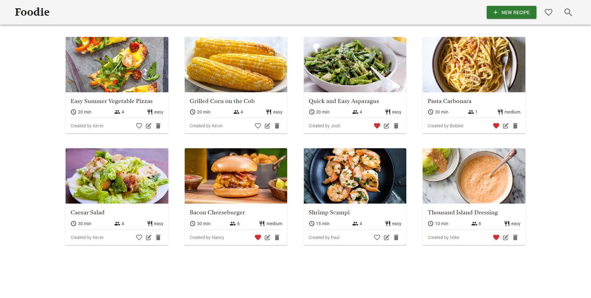
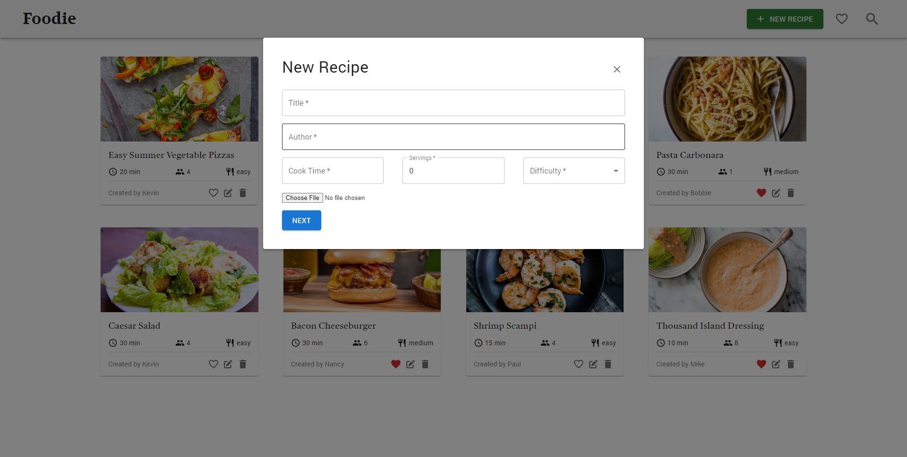
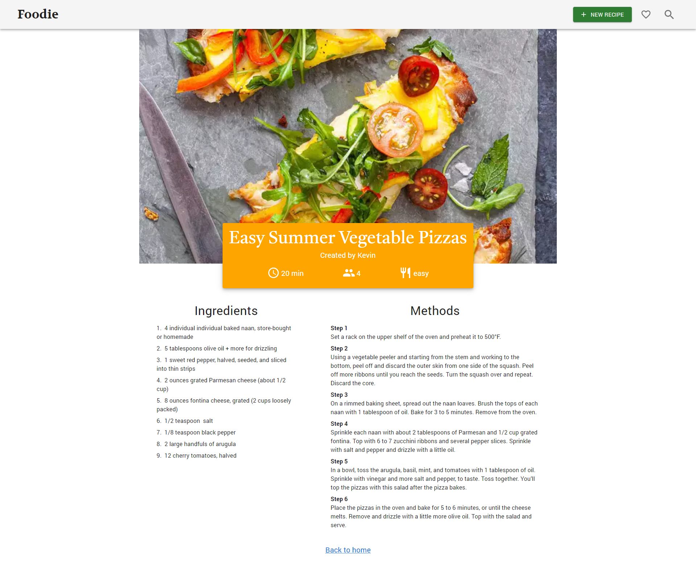

# Foodie App

## About Project

This app is called "Foodie", it's a simple recipe app that allows users to create, update, delete and like recipes.<br>
This is my first time that I built a MERN stack app. It really helps me to understand how frontend and backend are connected each other and how database works.
**[See Live Version](https://app-foodie.netlify.app/)**

### Built With

#### Frontend:

React.js, Redux, Material UI, React Router, Axios, Google Identity Service

#### Backend:

Node.js, Express, JWT, Google auth library, bcrypt

#### Database:

MongoDB

### Screenshots





### Key Features

- Show all posted recipes on home page
- Navigate to recipe details page when click recipe card
- Sign up a new account with email and password
- Sign in with email and Google login<br/>

#### After sign in users are allowed to:

- Create new recipe
- Edit or delete posted recipes
- Add favorite recipes to your account
- Only show favorite recipes
- Only show recipes that are created by user
- Log out

### Potential features in the future

- Upload multiple images when create recipe
- Recipes Pagination
- Ratings
- Search recipe
- User comments
- Welcome page

## Getting Started

### Usage

1. Clone the Repo

```bash
git clone https://github.com/KaixiangGU/foodie-app.git
```

2. Set Env Variables<br/>
   Create a .env file in the server folder and add following below

```bash
MONGODB_CONNECTION_URL = your MongoDB url
```

3. Install NPM packages (Frontend & Backend)

```bash
cd client
npm install
cd server
npm install
```

First, run the development server:

```bash
Frontend & Backend
npm start
# or
yarn start
```

Open [http://localhost:3000](http://localhost:3000) with your browser to see the result.
